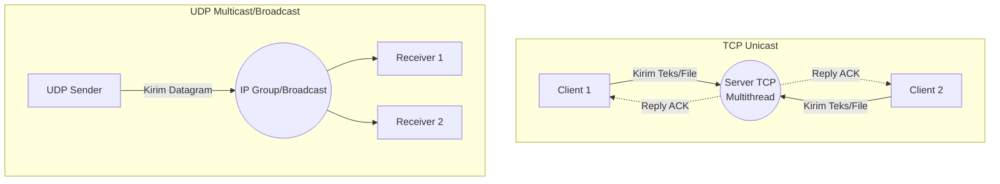
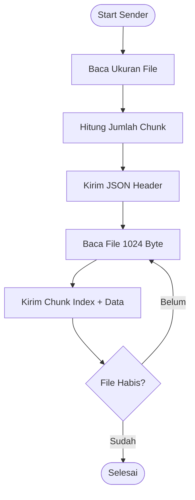

# Tugas Besar Socket Programming

Aplikasi Socket Programming komprehensif yang diimplementasikan menggunakan Python. Dibuat untuk memenuhi Tugas Besar Jaringan Komputer. Sistem ini mencakup pengiriman teks dan file menggunakan TCP Unicast, UDP Multicast, UDP Broadcast, dilengkapi dengan modul GUI Tkinter.

## 1. Penjelasan Arsitektur Sistem
Sistem ini memadukan 3 arsitektur besar:
* **TCP Unicast (Multithread):** Bersifat *Connection-Oriented*. Menggunakan arsitektur *Client-Server*. Server diatur menjadi *Multithread* (Daemon Threads) sehingga mampu menangani banyak Client serentak tanpa *blocking*.
* **UDP Multicast:** Bersifat *Connection-Less* (satu-ke-banyak selektif). Paket dialamatkan ke IP khusus Multicast Group (`224.1.1.1`).
* **UDP Broadcast:** Bersifat *Connection-Less* (satu-ke-semua massal). Paket dibuang ke alamat *Broadcast* (`255.255.255.255` / `<broadcast>`) untuk membanjiri jaringan LAN.

Karena menggunakan *byte stream* universal, kita merancang sebuah **Custom JSON Header** agar mesin dapat membedakan mana pesan Teks dan mana pesan File, beserta ekstensi dan ukurannya.

## 2. Diagram Komunikasi TCP & UDP

## 3. Flowchart Transfer File UDP (Mekanisme Chunking)

## 4. Panduan Instalasi
1. Pastikan Anda telah menginstal **Python 3.13+**.
2. *Clone* atau esktrak *source code* ini ke dalam satu *folder*.
3. Sistem murni menggunakan pustaka standar Python bawaan (*Standard Libraries*) seperti `socket`, `threading`, `json`, `struct`, dan `tkinter`. **Tidak perlu** menginstal pustaka pihak ketiga melalui `pip`.

## 5. Panduan Demo Presentasi
Kami merekomendasikan skenario berikut saat presentasi:
1. **Demo Unicast TCP Multithread:**
   * Buka 3 Terminal. Terminal pertama eksekusi `python unicast/server.py`.
   * Terminal 2 dan 3 eksekusi `python unicast/client.py`.
   * Tunjukkan pengiriman sebuah Teks dan sebuah File (`.jpg`) secara hampir bersamaan. Perlihatkan *progress bar* yang berjalan paralel.
2. **Demo UDP Multicast:**
   * Jalankan dua kali `python multicast/receiver.py`.
   * Jalankan satu `python multicast/sender.py` lalu kirim file video `.mp4`. Tunjukkan bahwa 1x aksi kirim akan mendistribusikan file ke 2 *Receiver* sekaligus melalui teknik *Chunking*.
3. **Demo GUI (Nilai Tambahan):**
   * Buka `python gui/server_gui.py` klik Start. Buka `python gui/client_gui.py` klik Connect.
   * Tunjukkan UI interaktif untuk *chatting* dan pilih file (*file picker*).

## 6. Daftar Pertanyaan Dosen & Kunci Jawaban
1. **Mengapa UDP perlu dipecah (*chunking*) saat mengirim file, sedangkan TCP tidak?**
   * *Jawaban:* UDP bersifat *datagram-based* dan dikirim mentah-mentah. Sebuah paket dibatasi oleh ukuran MTU (sekitar 1500 byte) router. Jika dikirim langsung 10MB, paket akan ditolak (*dropped*). Sedangkan TCP bersifat *Stream*, OS otomatis mengatur segmentasi paket dan merakit ulang (*reassembly*) di bawah kap.
2. **Apa yang terjadi jika jaringan lemot atau paket UDP hilang di jalan?**
   * *Jawaban:* UDP tidak punya fitur *Retransmission* bawaan. Dalam implementasi dasar kami, *receiver* akan mendeteksi dari indikator *Progress Receive* yang tidak mencapai 100% atau kena *Timeout* (gagal). Untuk menjadikannya *Reliable UDP*, kita perlu memprogram logika *Ack/Nack* tambahan (seperti protokol TFTP).
3. **Apa gunanya perintah `sock.setsockopt(..., SO_REUSEADDR, 1)`?**
   * *Jawaban:* Agar jika server *crash* atau dimatikan mendadak, kita bisa langsung menjalankan program lagi tanpa perlu menunggu sistem operasi merilis proteksi *port* tersebut dari status `TIME_WAIT`.
